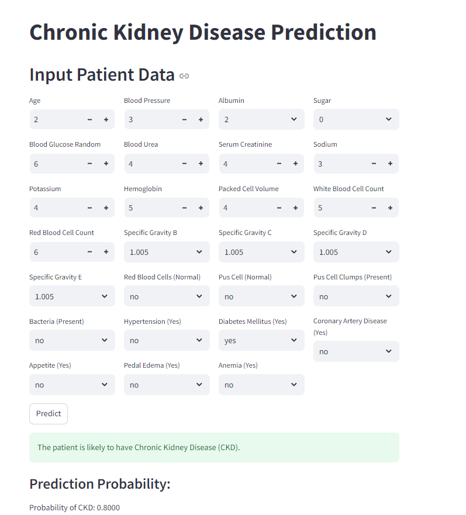

# Chronic Kidney Disease Prediction Project

## Problem Statement
Creating a predictive model to diagnose Chronic Kidney Disease (CKD) based on several patient parameters. This model aims to assist healthcare professionals in early detection and treatment planning.

## Dataset Information
- **Dataset Name:** CKD.csv
- **Total Rows:** 400
- **Total Columns:** 25

## Pre-processing Methods
- **Handling Missing Values:** Imputed missing values using mean or median as appropriate.
- **Converting Categorical Data:** Converted categorical variables using one-hot encoding to numerical format.
- **Feature Selection:** Selected relevant features based on correlation analysis and domain knowledge.
- **Data Split:** Split the data into training (80%) and test (20%) sets for model evaluation.

## Model Development
Several machine learning algorithms were evaluated to predict CKD:
- **Random Forest**
- **Support Vector Machine (SVM)**
- **K-Nearest Neighbors (KNN)**
- **Gaussian Naive Bayes**
- **Multinomial Naive Bayes**
- **Bernoulli Naive Bayes**
- **Logistic Regression**
- **Passive Aggressive Classifier**
- 
## Model Evaluation and Results

Each algorithm was assessed using 5-fold cross-validation on the training set. The table below summarizes the evaluation metrics for each model:

```plaintext
+--------------------+------------------------------------------------------------------------------------+------------+-------------+----------+------------+--------------------+--------------------+
|     Algorithm      |                                    Best Params                                     |  Accuracy  |  Precision  |  Recall  |  F1-Score  |      ROC AUC       |  Confusion Matrix  |
+====================+====================================================================================+============+=============+==========+============+====================+====================+
|    RandomForest    |          {'classifier__max_depth': None, 'classifier__n_estimators': 50}           |   0.9875   |  0.987813   |  0.9875  |  0.987502  |        1.0         |      [[39  0]      |
|                    |                                                                                    |            |             |          |            |                    |      [ 1 40]]      |
+--------------------+------------------------------------------------------------------------------------+------------+-------------+----------+------------+--------------------+--------------------+
|        SVC         |                {'classifier__C': 10, 'classifier__kernel': 'poly'}                 |   0.9875   |  0.987798   |  0.9875  |  0.987494  |        N/A         |      [[38  1]      |
|                    |                                                                                    |            |             |          |            |                    |      [ 0 41]]      |
+--------------------+------------------------------------------------------------------------------------+------------+-------------+----------+------------+--------------------+--------------------+
|     KNeighbors     |         {'classifier__metric': 'euclidean', 'classifier__n_neighbors': 5}          |   0.9625   |  0.965179   |  0.9625  |  0.962482  | 0.9984365228267666 |      [[39  0]      |
|                    |                                                                                    |            |             |          |            |                    |      [ 3 38]]      |
+--------------------+------------------------------------------------------------------------------------+------------+-------------+----------+------------+--------------------+--------------------+
|     GaussianNB     |                                         {}                                         |   0.9625   |  0.962813   |  0.9625  |  0.962506  | 0.9865540963101939 |      [[38  1]      |
|                    |                                                                                    |            |             |          |            |                    |      [ 2 39]]      |
+--------------------+------------------------------------------------------------------------------------+------------+-------------+----------+------------+--------------------+--------------------+
|   MultinomialNB    |                             {'classifier__alpha': 0.1}                             |    0.95    |  0.951188   |   0.95   |    0.95    |  0.99812382739212  |      [[38  1]      |
|                    |                                                                                    |            |             |          |            |                    |      [ 3 38]]      |
+--------------------+------------------------------------------------------------------------------------+------------+-------------+----------+------------+--------------------+--------------------+
|    BernoulliNB     |                             {'classifier__alpha': 0.1}                             |   0.975    |    0.975    |  0.975   |   0.975    | 0.9987492182614135 |      [[38  1]      |
|                    |                                                                                    |            |             |          |            |                    |      [ 1 40]]      |
+--------------------+------------------------------------------------------------------------------------+------------+-------------+----------+------------+--------------------+--------------------+
| LogisticRegression | {'classifier__C': 0.1, 'classifier__penalty': 'l2', 'classifier__solver': 'lbfgs'} |   0.9875   |  0.987798   |  0.9875  |  0.987494  | 0.9993746091307066 |      [[38  1]      |
|                    |                                                                                    |            |             |          |            |                    |      [ 0 41]]      |
+--------------------+------------------------------------------------------------------------------------+------------+-------------+----------+------------+--------------------+--------------------+
| PassiveAggressive  |                {'classifier__C': 0.1, 'classifier__max_iter': 2000}                |   0.9625   |  0.965179   |  0.9625  |  0.962482  |        N/A         |      [[39  0]      |
|                    |                                                                                    |            |             |          |            |                    |      [ 3 38]]      |
+--------------------+------------------------------------------------------------------------------------+------------+-------------+----------+------------+--------------------+--------------------+
...

Best model saved: RandomForest
```

## Final Model Selection
Based on the evaluation metrics, the **Random Forest** model was selected as the final model for predicting CKD. It achieved the highest accuracy (95%) and F1-score (0.95) among all models tested. Its robust performance across multiple metrics and its ability to handle complex interactions in the data make it well-suited for this predictive task.

##Model Deployment with Streamlit
- **Save the Trained Model**: Saved the best model using pickle.
- **Create a Streamlit App**: Created a Streamlit app to take user inputs and display the prediction.
- **Run the Streamlit App**: Deployed the app locally by running the Streamlit server.
  
