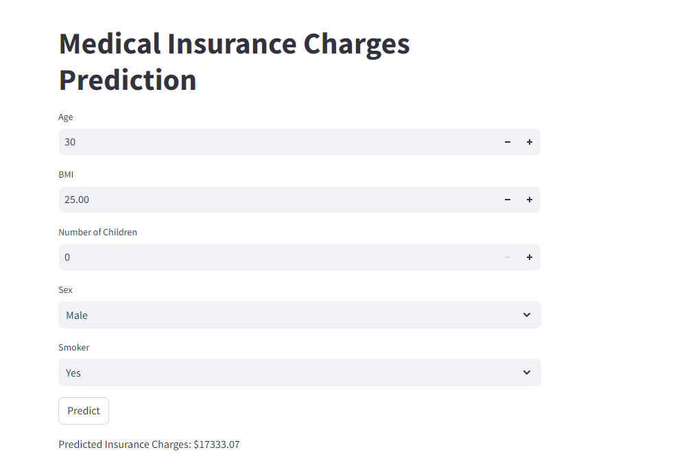

# Medical Insurance Charges Prediction

## 1. Introduction
Predicting insurance prices is a crucial task for insurance companies to assess risk and determine premiums. This project aims to build a machine learning model to predict insurance charges based on various parameters using a given dataset.

## 2. Project Overview
The goal of this project is to develop a robust machine learning model that accurately predicts insurance charges. We will go through the following steps:

- **Data Collection**
- **Exploratory Data Analysis (EDA)**
- **Data Preprocessing**
- **Model Selection and Training**
- **Model Evaluation**
- **Hyperparameter Tuning**
- **Model Deployment**

## 3. Data Description
The dataset provided includes the following columns:

- Age: Age of the policyholder
- Sex: Gender of the policyholder (male/female)
- BMI: Body Mass Index
- Children: Number of children/dependents
- Smoker: Smoking status (yes/no)
- Region: Residential area in the US (northeast, northwest, southeast, southwest)
- Charges: Insurance charges (target variable)

## 4. Exploratory Data Analysis (EDA)
- **Understanding the Data**: Load the dataset and display the first few rows.
- **Summary Statistics**: Get summary statistics to understand the distribution of the data.
- **Data Visualization**: Use plots (histograms, box plots, scatter plots) to visualize relationships between variables.

## 5. Data Preprocessing
- **Handling Missing Values**: Check for and handle any missing values.
- **Encoding Categorical Variables**: Convert categorical variables into numerical format using techniques like one-hot encoding.
- **Feature Scaling**: Normalize or standardize numerical features.

## 6. Model Selection
We will evaluate the following models:
- Simple Linear Regression
- Multiple Linear Regression
- Support Vector Machine (SVM)
- Decision Tree
- Random Forest

## 7. Model Training
- Split the data into training and testing sets and train the models.

## 8. Model Evaluation

|    | Model             | MAE     | MSE         | R²        |
|----|-------------------|---------|-------------|-----------|
| 0  | Linear Regression | 4213.48 | 3.39793e+07 | 0.78113   |
| 1  | SVR               | 8597.35 | 1.66235e+08 | -0.070765 |
| 2  | Decision Tree     | 3175.98 | 4.67887e+07 | 0.698621  |
| 3  | Random Forest     | 2540.1  | 2.19508e+07 | 0.858609  |

## 9. Hyperparameter Tuning
- Use Grid Search or Random Search to find the best hyperparameters for the selected model(s).

## 10. Save the Trained Model
- Save the trained model using pickle.

## 11. Model Deployment with Streamlit
- **Save the Trained Model**: Saved the best model using pickle.
- **Create a Streamlit App**: Created a Streamlit app to take user inputs and display the prediction.
- **Run the Streamlit App**: Deployed the app locally by running the Streamlit server.
  

## Conclusion
Based on the model evaluation results, the Random Forest model outperformed other models with the lowest Mean Absolute Error (MAE), Mean Squared Error (MSE), and highest R-squared (R²) score. This indicates that the Random Forest model is the most suitable for predicting insurance charges in this dataset.
