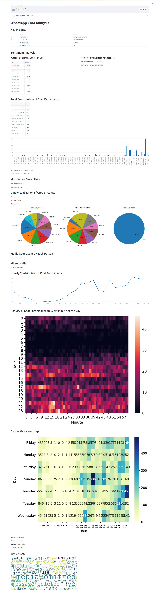

# WhatsApp Chat Analyzer

## Project Overview
The WhatsApp Chat Analyzer is a Python-based tool designed to extract and analyze data from WhatsApp chat exports. It provides insights into various aspects of chat activity, such as participant contributions, media counts, missed calls, and sentiment trends. The tool utilizes natural language processing and data visualization techniques to offer detailed analytics and visual representations of chat data.

## Technology Used
- **Python**: The primary programming language used for data processing and analysis.
- **Streamlit**: For creating an interactive web application interface.
- **Pandas**: For data manipulation and analysis.
- **Matplotlib**: For creating static, interactive, and animated visualizations.
- **Seaborn**: For statistical data visualization.
- **WordCloud**: For generating word clouds from text data.
- **NLTK**: For natural language processing tasks, such as removing stopwords.
- **TextBlob**: For sentiment analysis of chat messages.
- **Emoji**: For filtering out emojis from text.

## Key Features
- **Participant Contribution Analysis**: Displays the total contribution of each chat participant.
- **Talkative and Less Talkative Members**: Identifies the most and least talkative members in the chat.
- **Activity Insights**: Shows the most active days and times based on chat activity.
- **Media Count Analysis**: Counts media messages sent by each participant.
- **Missed Calls**: Identifies missed calls and counts occurrences by user.
- **Hourly and Minute-by-Minute Activity**: Provides insights into chat activity on an hourly and minute-by-minute basis.
- **Chat Activity HeatMap**: Visualizes chat activity throughout different times of the day and days of the week.
- **Word Cloud Visualization**: Generates word clouds to visualize common words and themes in messages.
- **Sentiment Overview**: Analyzes and visualizes the sentiment of messages over time.
- **Trend Analysis**: Tracks emerging topics and trends over time.
- **Group Activity Data Visualization**: Shows most busy days, months, years, and users.

## Prerequisites
To run the WhatsApp Chat Analyzer, ensure you have the following installed:
- Python 3.7 or higher
- Streamlit
- Pandas
- Matplotlib
- Seaborn
- WordCloud
- NLTK
- TextBlob
- Emoji

## Project Demo

## Summary
The WhatsApp Chat Analyzer provides a comprehensive suite of tools for analyzing WhatsApp chat data. By leveraging various data processing and visualization techniques, it enables users to gain insights into chat dynamics, participant behavior, and trends. Whether you're looking to understand chat activity patterns, analyze participant contributions, or visualize message sentiments, this tool offers a robust solution for in-depth chat analysis.

